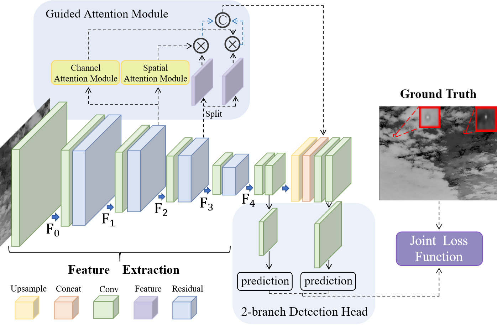
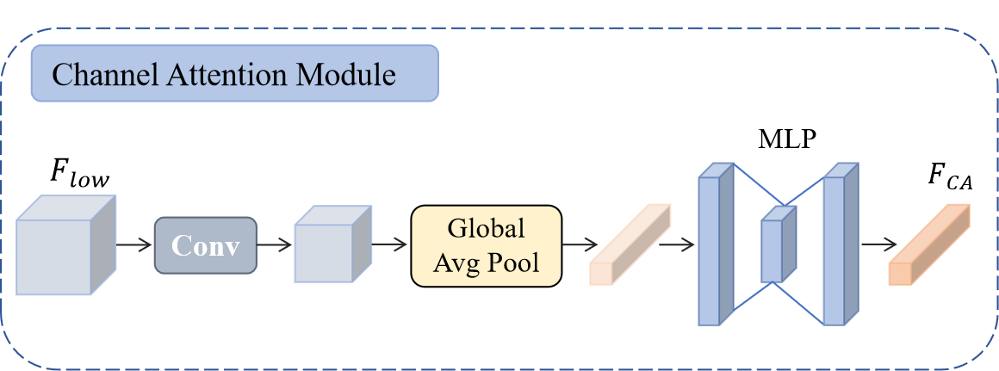

## Method overview

  <table border=1 frame=void rules=none ><tr>
  <td></td>
  <td></td>
  </tr></table>

## Environment
python3.8 + pytorch1.10 + requirments
## Training
python train.py
## Support dataset 
IRSTD/SIRST/SIATD
